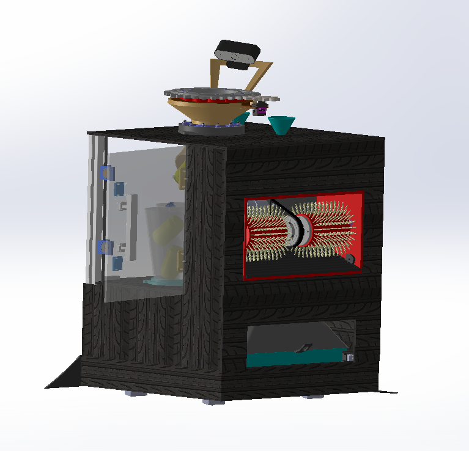

<div align="center">

# MONGEYA

### Smart Home Cleaning Station with an Autonomous Cleaning Robot

*A modular robotic ecosystem designed to automate repetitive household cleaning tasks.*




Built by **HABBOUBY EDEM** for [Beest](https://beest.hackclub.com/)

</div>

---

# About

MONGEYA is a smart cleaning station that automates several repetitive household tasks. It combines multiple cleaning systems inside a single machine and works together with **MONGY**, a compact autonomous robot that leaves the station to clean the floor before returning automatically to recharge.

The entire mechanical structure, electronics, and custom PCB were designed from scratch.

---

# Scope of This Submission

This submission covers the **mechanical design (CAD)** and the **custom PCB (KiCad)** for MONGEYA and Mongy. Firmware/embedded code is not included at this stage — this project is being submitted as a hardware and electronics design.

---

# ⚠️ Note on Physical Fabrication

This submission is provided as a **complete, print-ready CAD and PCB design** (STEP, STL, and KiCad project).

I do not currently have access to a 3D printer, and professional 3D printing services are costly and limited where I live (Tunisia). For this reason, I was not able to physically fabricate and photograph the assembled parts before submission.

Every file needed to reproduce MONGEYA and Mongy — including slicer-ready STL exports and print settings — is included in this repository, so the design can be fabricated and verified by anyone with access to a 3D printer.

**On 3D printing access in Tunisia:** Access to 3D printing hardware in Tunisia is particularly constrained. Import duties and customs taxes on 3D printers and electronics significantly raise their price compared to international markets, putting personal ownership out of reach for many students. Local makerspaces with printing capability are few, mostly concentrated in the capital, and operate as private, paid facilities with limited slots rather than open-access community labs. Online/local printing services exist but are costly and add delays for a project of this scale (multiple large structural parts). For these reasons, physical fabrication of MONGEYA and Mongy has not yet been possible, and the design is submitted as a complete, print-ready package so it can be reproduced and verified by anyone with printer access.

**Consequence for the live demo / playable version:** for the same reason, no live demo or playable version of the physical robot exists yet — there is no functioning hardware to record or interact with. In place of a live demo, the **Demo URL** points to a CAD walkthrough (renders / exploded view / turntable) so reviewers can still see the design in motion and in detail.

---

# On AI Assistance

As this is my first time using GitHub to structure and share a project of this scale, I used AI assistance to help review this submission against the shipping guide requirements, research relevant resources, and refine parts of this documentation. All design work — CAD modeling, PCB design, and engineering decisions — is my own.

---

# Why I Built This

The inspiration behind MONGEYA comes from my mother.

Every day she spends a significant amount of time cleaning shoes, sorting waste, and handling repetitive household chores. I wanted to design a machine capable of taking over these repetitive tasks, giving her more free time while making home cleaning easier and smarter.

---

# Meet MONGY

MONGY is the autonomous cleaning robot inside MONGEYA.

MONGY leaves its docking station, cleans the surrounding area using multiple cleaning mechanisms, and automatically returns to recharge.

---

# Features

- Automatic waste sorting (aluminum / plastic / paper)
- Automatic chemical dispensing (bleach + cleaning gel)
- Shoe cleaning station
- Autonomous floor cleaning
- Automatic docking and locking mechanism
- Automatic battery charging
- LiDAR navigation
- PID motor control with encoders
- Custom ESP32 PCB
- Fully 3D printable mechanical design

---

# Hardware

## Main Controller
- ESP32-WROOM-32

## Navigation
- RPLIDAR
- Hall-effect magnetic encoders
- IR sensors

## Motors
- JGB37 DC gear motors
- MG995 servo motors
- MG90 metal gear servo

## Cleaning
- Roller brush
- 12V vacuum pump
- Two 12V dosing pumps

## Batteries
**MONGY** — Compact 3S LiPo battery
**MONGEYA** — Three independent 3S LiPo batteries powering different subsystems

---

# Dimensions

## MONGY

| Property | Value |
|----------|------:|
| Diameter | 210 mm |
| Height | 50 mm |
| Weight | ~2 kg |

## MONGEYA

| Property | Value |
|----------|------:|
| Length | 400 mm |
| Width | 400 mm |
| Height | 600 mm |
| Weight | ~15 kg |

---

# 3D Printing

## Materials
- ABS for structural and high-stress components
- PLA for lightweight and cosmetic parts

## Recommended Print Settings

| Setting | Value |
|---------|------|
| Layer Height | 0.20 mm |
| Nozzle | 0.4 mm |
| Infill | 20% |
| Walls | 3 |
| Supports | Only where needed |

---

# Fasteners

| Screw | Quantity |
|-------|---------:|
| M3 × 10 mm | 25 |
| M3 × 13 mm | 15 |
| M3 × 15 mm | 15 |
| M3 × 19 mm | 5 |

Total: **60 M3 screws**

---

# Electronics

MONGY uses a custom PCB designed in **KiCad** around the **ESP32-WROOM-32**.

The `02_PCB/mongy/` folder contains:
- Fabrication files (Gerbers, drill files) — `FABRICATION/`
- Component list

The MONGEYA station intentionally uses modular perfboards for auxiliary circuits such as chemical dispensing and opto-isolated interfaces, making maintenance and future upgrades easier.

---

# Repository Structure

```text
mongeya-main/
│
├── 01_3D/
│   ├── SOLIDWORKS PARTS/
│   │   ├── MONGEYA & MONGY solidworks parts/   # Full native source — Mongy lives inside MONGEYA, so its parts are bundled here too 🙂
│   │   ├── MONGY solidworks parts/              # Standalone native source for Mongy only
│   │   ├── protection system/
│   │   ├── assembly MONGEYA/
│   │   └── assembly MONGY/
│   │
│   ├── STL/
│   │   ├── STL FILES MONGEYA/
│   │   └── STL MONGY/
│   │
│   ├── cleaning robot mongySTEP/                # STEP source for Mongy only — the standalone cleaning robot, separate from the station
│   └── main station mongeyaSTEP.rar             # Single .rar — this assembly is a single (but heavy) STEP file, zipped to keep the repo light
│
├── 02_PCB/
│   └── mongy/
│       ├── FABRICATION/     # Gerbers + drill files
│       └── Component list PCB DESIGN.xlsx
│
├── 03_docs/
│   ├── CAD different view/
│   ├── renders/
│   ├── wiring/
│   └── PRESENTATION.pdf
│
├── 04_media/
│   └── hero.png
│
└── README.md
```

**On the "MONGEYA & MONGY solidworks parts" folder:** since Mongy physically docks and lives inside MONGEYA (it's the little robot that comes out of the big station, hihi 🐢🏠), the full combined SolidWorks source for both is kept together in one folder — this is the one to open if you want the complete ecosystem in a single assembly. The separate **"MONGY solidworks parts"** folder exists for anyone who only wants to reproduce the standalone cleaning robot on its own, without the station.

**On `cleaning robot mongySTEP`:** this folder holds the STEP export specifically for Mongy alone — useful if you just want to print/inspect the robot without pulling in the whole MONGEYA station.

**Note on file compression:** The `main station mongeya` assembly is provided as a single `.rar` because it is one large STEP file — zipping it keeps the repository lighter and faster to clone. It can be extracted with any standard tool (WinRAR, 7-Zip, The Unarchiver), and the STEP file inside remains fully editable in any CAD application. The STL exports are already slicer-ready as-is, no extraction needed beyond opening the STL folders.

---

# Assembly

1. Print all STL files (`01_3D/STL/`) using the settings above.
2. Assemble the mechanical structure using the specified M3 screws — see renders in `03_docs/renders/`.
3. Install the motors, pumps, and sensors.
4. Mount the custom PCB inside Mongy.
5. Connect batteries and wiring — see `03_docs/wiring/`.
6. Dock Mongy inside MONGEYA.

---

# CAD Files

This repository includes:
- **STEP files** — `01_3D/cleaning robot mongySTEP/` for Mongy, and `01_3D/main station mongeyaSTEP.rar` for MONGEYA, fully editable in any CAD tool
- **Native SolidWorks source** — `01_3D/SOLIDWORKS PARTS/`, split into the combined MONGEYA+MONGY assembly and the standalone Mongy parts
- **STL files** — `01_3D/STL/`, ready to slice and print

allowing anyone to modify, remix, or reproduce the project.

---

# Renders

<p align="center">
  
  
</p>
<p align="center">
  
</p>

*(Note: rename any image with accents or spaces — e.g. "système de tri" → "systeme_de_tri" — to avoid broken image links on GitHub. Update the path above to match the exact final filename.)*

A full turntable / exploded-view video is linked in the **Demo URL** field of the submission.

---

# Documentation

Additional documentation is available inside `03_docs/`, including:
- Project presentation (`PRESENTATION.pdf`)
- CAD views and renders (`CAD different view/`, `renders/`)
- Wiring diagrams (`wiring/`)

---

# Future Improvements

- AI-based object recognition
- Automatic water refill
- Mobile application
- Voice assistant integration
- Multi-room navigation
- Firmware development (navigation, sorting logic, PID tuning)

---

# License

This project is released under the **MIT License**.
